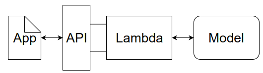
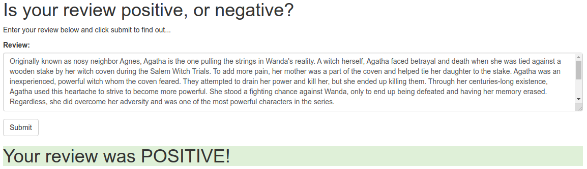

# Machine Learning Engineer Nanodegree

## Deploy a Sentiment Analysis Model Project

This projects consists in the deployment of a RNN-LSTM for sentiment analysis with Pytorch.

## Main Components

* Python 3.6
* Pytorch
* AWS
  * Sagemaker
  * Lambda
  * API Gateway

## Operation

When correctly trained and deployed, the model will be made available through a private *Sagemaker Endpoint*, that will sit behind an API Gateway + Lambda integration:

## Final Result

